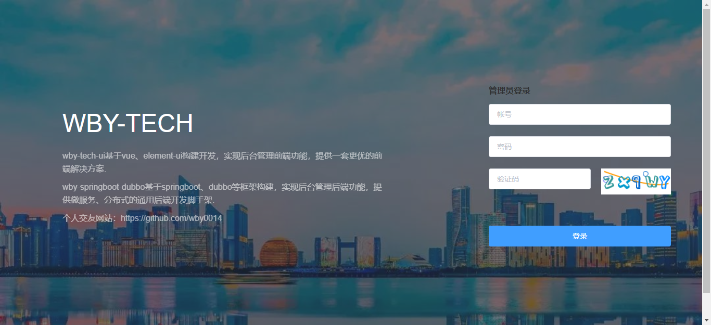
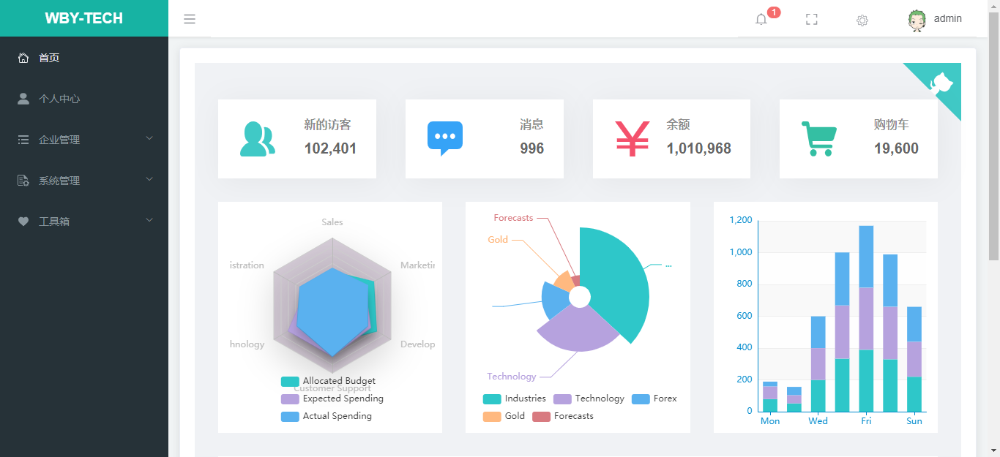
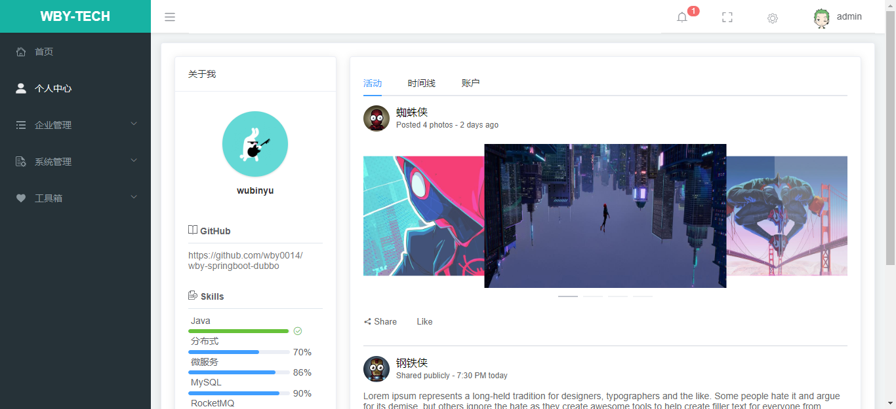
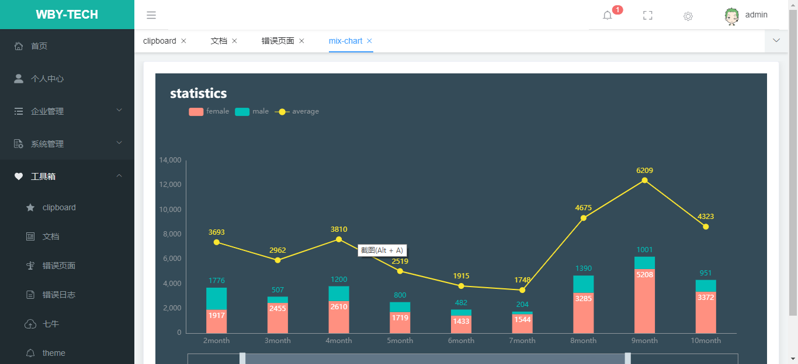
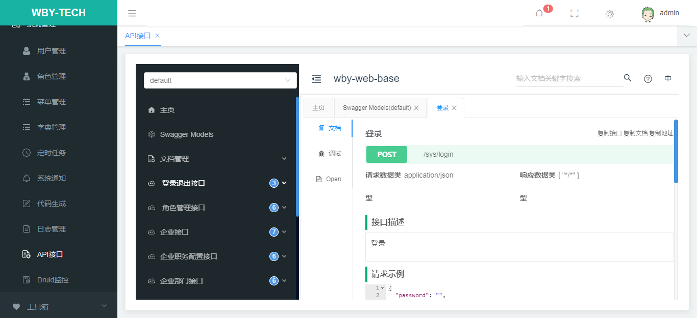
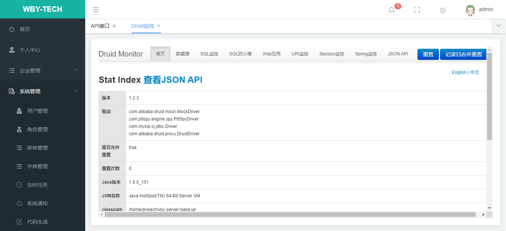

#### wby-springboot-dubbo
+ wby-springboot-dubbo微服务开发平台，具有统一授权、认证后台管理系统，其中包含具备用户管理、资源权限管理等多个模块，支持多业务系统并行开发，可以作为后端服务的开发脚手架。代码简洁，架构清晰，适合学习和直接项目中使用。
+ 核心技术采用SpringBoot、Dubbo、Mybatis、Mybatis-plus、Druid、Redis、ActiveMQ、Quartz、JWT Token等主要框架和中间件。前端采用vue-element-ui组件。
+ 前后端分离，通过token进行数据交互，可独立部署
+ 灵活的权限控制，可控制到页面或按钮，满足绝大部分的权限需求
+ 页面交互使用Vue2.x，极大的提高了开发效率
+ 完善的代码生成机制，可在线生成entity、xml、dao、service、vue、sql代码，减少70%以上的开发任务
+ 引入dubbo服务治理
+ 引入quartz定时任务，可动态完成任务的添加、修改、删除、暂停、恢复及日志查看等功能
+ 引入API模板，根据token作为登录令牌，极大的方便了APP接口开发
+ 引入Hibernate Validator校验框架，轻松实现后端校验
+ 引入swagger文档支持，方便编写API接口文档
+ 演示地址：http://locahost:8090 (账号密码：admin/123456)


#### 项目地址

 平台  | wby-springboot-dubbo（后端）  |wby-dubbo-ui（前端）
---|---|---
GitHub | [https://github.com/wby0014/wby-springboot-dubbo](https://github.com/wby0014/wby-springboot-dubbo) |[https://github.com/wby/wby-dubbo-ui](https://github.com/wby/wby-dubbo-ui)


#### 代码结构
``` lua
wby-springboot-dubbo
├── docker                             -- docker脚本文件
    ├── server-base                        -- wby-server-base脚本
    ├── server-notice                      -- wby-server-notice脚本
    ├── web-base                           -- wby-base-web脚本

├── docs                               -- 文档及脚本
    ├── config                         -- dubbo控制台
    ├── img                            -- 系统图片截图  
    ├── sql                            -- sql文件  
     
├── wby-common                        -- 通用模块
    ├── wby-common-core                        -- 系统核心包
    ├── wby-common-starter-datasource          -- 系统数据库自动装配starter  
    ├── wby-common-starter-redis               -- 系统redis自动装配starter
    ├── wby-common-starter-redisson            -- 系统redisson自动装配starter
├── wby-service
    ├── wby-api-base                           -- 基础服务接口
    ├── wby-server-base                        -- 基础服务提供者服务器[port = 8181]
    ├── wby-api-notice                         -- 系统消息服务接口
    ├── wby-server-notice                      -- 系统消息服务提供者服务器[port = 8182]
    ├── wby-web-base                           -- 服务消费者服务器[port = 8190]
├── wby-monitor                       -- SpringBootAdmin监控服务[port = 8180]
```


#### 快速开始

1. 准备环境
    + Java1.8  (v1.8.0_131+)
    + Zookeeper服务发现和注册中心(v3.4.14+)<a href="https://mirrors.tuna.tsinghua.edu.cn/apache/zookeeper/zookeeper-3.4.14/zookeeper-3.4.14.tar.gz">下载地址</a>
    + Redis (v3.2.100+)
    + ActiveMQ(v5.15.8+)<a href="http://activemq.apache.org/components/classic/download/" target="_blank">下载地址</a>
    + RabbitMq (v3.7+)（需安装rabbitmq_delayed_message_exchange插件 <a href="https://www.rabbitmq.com/community-plugins.html" target="_blank">下载地址</a>）
    + Mysql (v5.7.26+)
    + Maven (v3+)
    + Nodejs (v10.16.0+)
   
2. 执行创建数据库wby-springboot-dubbo并执行sql脚本
   
    + docs/sql/wby-springboot-dubbo.sql
    
3. 启动Zookeeper服务发现和注册中心
    +

4. 启动ActiveMQ
   +

5. 初始化maven项目  
    ``` bush
        maven clean install
    ```

6. 本地启动(按顺序启动)
     1. [必需]ServerBaseApplication(基础服务提供者服务器)
     2. [必需]ServerNoticeApplication(系统消息服务提供者服务器)
     3. [必需]WebBaseApplication(基础服务消费者服务器)
     4. [必需]MonitorApplication(SpringBootAdmin监控服务)
     ```
       + 访问 http://localhost:8190
       + 访问基础平台API http://localhost:8190/doc.html
     ```
     
7. 前端启动
    1. 安装淘宝NPM镜像
    ```bush
    npm install -g cnpm --registry=https://registry.npm.taobao.org
    npm config set registry  https://registry.npm.taobao.org
    ```
    2. 运行
    ```bush
        cnpm install 
        npm run dev
    ```
    访问 http://localhost:8090
    
8. 项目打包部署  
     maven多环境打包,并替换相关变量
   ```bush
      clean install -D profileActive={dev|test|prod} -f pom.xml
   ```

9. JVM优化
     ```bush  
        -Xmx256m -Xms256m -Xss1m -Xmn128m -XX:+PrintGCDetails  
     ```

#### 系统预览
<table>
  <tr>
     <td></td>
     <td></td>
  </tr>
  <tr>
     <td></td>
     <td></td>
  </tr>
  <tr>
     <td></td>
     <td></td>
  </tr>
  <tr>
    <td></td>
    <td></td>
  </tr>
</table>

#### 技术交流
加入QQ群：


#### 开发计划

#### 更新日志
 ##### v1.0.0 
  + SpringBoot更新到2.3.6
  + Dubbo更新到2.7.8
  + 层级调整
  + 优化消息服务
  + 实现服务提供者之间相互调用
  + 实现消费者调用多个服务提供者
  + wby-web-base去掉数据库连接
  + 优化前端代码